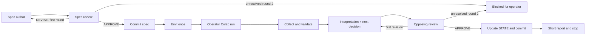

# Local Sprint10 acceptance lane

This is the known-case step(d) test. No server deployment, main merge, new paid
resource, training, final25 or reserve24 patient access. Engine review precedes
all scientific calls. The separate manual engine review is outside the eight
scientific-stage invocations by the operator's explicit clarification.

## Operations and limits

`python -m orchestrator.manual_driver init --root CHECKOUT --state PRIVATE_STATE
--engine-review ORIGINAL_ENGINE_APPROVAL.md`
requires a clean `astra/manual-*` source branch and an APPROVE report naming that
exact commit. A canonical owner record in local shared Git metadata prevents
starting another copy through a different state directory/worktree. Partial
initialization is preserved for inspection, never silently reset.

`python -m orchestrator.manual_driver status --state PRIVATE_STATE` reads status.
`python -m orchestrator.manual_driver advance --state PRIVATE_STATE` performs
one transition only. It never loops or resumes an uncertain model invocation.
At WAIT_OUTPUTS it returns the package location and stops. After the operator
runs Colab once and extracts the private return:
`python -m orchestrator.manual_driver advance --state PRIVATE_STATE
--collect-folder PRIVATE_RETURN_FOLDER` validates and preserves it. Invalid
returns are preserved in a rejected-return directory and block continuation.

Only `manual_context.prepare` builds model inputs. Its original scanner,
applicable verbatim obligations, stop checks and200000-character cap apply.
A source/profile/approval change blocks use; newly appended decisions reach the
existing reconciliation guard. The notebook and saved-output files are actually
placed in each native stage workspace. Stage outputs never authorize execution:
only the fixed approved package, reviewed spec and existing operator grant do.

Every native model invocation is reserved durably before launch. Each of four
roles is limited to two calls; the lifetime total is eight, including failed or
uncertain calls. No model fallback, automatic timeout retry, reset or refund.
`dispatch_limiter.admit_manual` reuses existing CAS, schema validation, policy
binding, duplicate accounting and the latched halt. The SQLite CAS adapter lives
in the same `job_store` database. This is the explicit local step(d) allowance,
not a reset or substitution of the remote server's accounting/pause state.
No remote ledger or protected service is modified. Package emission records a
manual job and zero new GPU spending; it does not execute Colab.

?Call? here means one native scientific-stage invocation, as in the operator's
1+1 allocation. Native tool/model iterations within that session remain in its
original console/session evidence; no claim that a file-reading session is one
provider HTTP request. Claude has the existing30-turn stage bound, a900-second
stage deadline and a960-second process-group cleanup watchdog. Codex and Claude
use existing subscription credentials; API/provider override variables are
removed. No provider canary is authorized or run. Native client availability
checks (`--version`, `--help`, auth metadata) are not model calls.

## Execution identity and equivalence

The spec binds the ordered code-cell sources. The emitted manifest holds that
reviewed list and its canonical hash. Colab formatting, metadata, execution
counts and saved outputs may change; any code-cell edit refuses. Scientific cells remain from the approved Sprint10
source. Packaging removes the obsolete Git fetch, fixes Drive mount as the first cell,
adds baseline preservation and identity checks, puts outputs in a new run
directory, and exports a bound private return. Split/exclusion bytes stay on
private Drive and must match DATA_CONTRACT. They are never copied into the
package, local lane or scientific workspace. Existing operator originals and
checkpoints remain preserved separately.
The original99-case assertion, seed0,2000 bootstrap draws and all metric code
remain unchanged. No run package is actually emitted before scientific approval.

Acceptance compares five complete original/new CSVs, including private per-case
rows locally: exact columns, row order, categorical text, counts and formatted
intervals; unformatted numeric values use atol1e-10/rtol1e-9. Only the old/new
comparison output-directory prefixes are normalized. Allowed JSON metadata
changes are utc, code_version, fingerprint and run_identity. Original Sprint8
and Sprint9 identities and all other comparison metadata must agree. The notebook checks the bound Drive-only split/exclusion pair; local validation
checks the99-case membership against the reviewed hash-pinned baseline table. Missing,
changed or out-of-scope originals fail closed. Difference diagnostics preserve
row/column indices without exposing patient values to models.

Only scanner-clean aggregate tables, validation counts, current interpretation
and proposed next decision enter interpretation workspaces. Full returns remain
private. Original manual outputs are not relabeled as system execution. A valid
return means the known-case comparison reproduced, not new efficacy, scientific
adoption or autonomous successor authority. Actual native consuming-client
retrieval and the real numerical reproduction await approval and the Colab run;
synthetic deterministic tests do not establish them.

## Review/check scope

New code: manual_executor, manual_driver, manual_stage, manual_package and
manual_validation. Existing changes: narrow manual accounting-event branch and
baseline result-table selection for the two spec roles. All legacy accounting
branches, hosted admission, recovery and deployment routes remain unchanged.
Tests cover duplicate/uncertain dispatch, replay accounting, halt and call caps,
scoped stops, exact engine/source bindings, fixed blocker categories, two-round
stop, original/result/cohort integrity, package preview, and the complete path
with clearly synthetic models/data. No real scientific call or Colab execution
has occurred during engine preparation.

## Round2 recovery and privacy boundaries

Only a bound `IDENTITY_REFUSED_BEFORE_COMPUTATION` record from the fixed guard,
with no return/start marker, permits `advance --identity-refusal PATH` to copy
the unchanged original package into a new re-emission directory. The refusal and
copy receipt are preserved; dispatch history and call accounting are not reset.
This is package replacement before computation, not a retry of failed or
uncertain computation. A later failure remains blocked for an explicit decision.
Repeated reconciliation of the same refusal reuses the recorded copy.

`status` includes the saved block reason and DECISION_REQUEST.md. The decision
request names stage, round, category and preserved review/evidence; it never
conveys new execution authority. Malformed returns are saved under rejected-
return and block continuation. The private inbox path is shown in status.

A hash of prepare()'s exact body is reserved in the call receipt. A small stdin
adapter verifies that hash immediately before starting the native client and
forwards those identical bytes. It writes sent-input.json. Mismatch starts no
model. Original console/native receipts remain preserved; no new model fallback.

Native author setting: Codex workspace-write, approvals never, network disabled
for sandboxed commands. This restricts writes, not general reads. The process
runs as the current WSL user and can read files that user can read, including
home, mounted Windows files, other workspaces and compatible Windows paths via
interop. Prompt instructions are not a mechanical privacy boundary. Claude's
local Read/Write/Edit allow rules are also not an OS-level read jail.

Stage workspaces are in a separate sibling directory, not beneath private
returns. Every native call is preceded by a Windows/WSL Drive check before any
reservation and again at invocation. A readable Google Drive volume, DriveFS
process or extra readable WSL drive-letter mount refuses. Because quitting Drive
does not remove cached contents, a known DriveFS cache also refuses pending
mechanical read isolation. No model call is authorized while that guard blocks.
The operator requires uncertain locked data to be treated as possibly present.

Proposed, NOT implemented: an outer Bubblewrap namespace around the existing
client subprocess, reusing installed bwrap. Expose only read-only runtime files,
selected stage workspace, an empty temporary home and necessary existing auth
files. Omit /mnt, host home, project private evidence, returns and DriveFS; no
Windows interop. Preserve native receipts and model transport. Before use, test
allowed evidence reads/writes and refusal of canaries at private/Drive/host paths
with the actual configured commands. Review that narrow change independently.
A separate Unix user alone would not hide world-readable Windows mounts.

A6 remains advisory: a deliberate fresh clone plus new operator-supplied exact
approval could create a fresh local ledger. This branch does not make that a
supported reset route; the one acceptance task must use its canonical saved
state. No clone, reset or extra allowance is authorized by these instructions.
