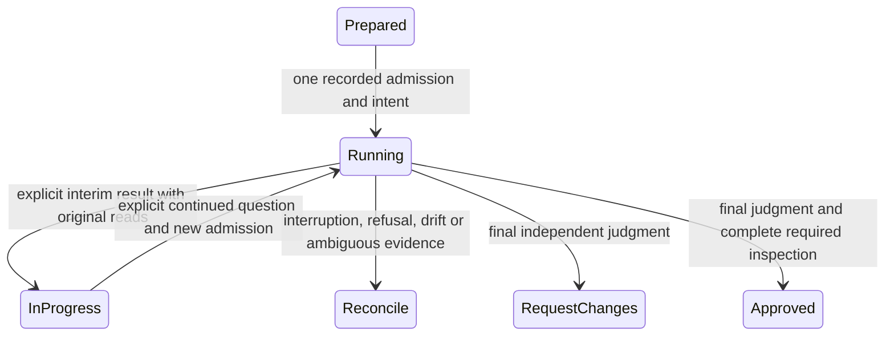

# Formal direct inspection and continuation

Status: proposed implementation; source approval, native boundary evidence and
deployment are separate recorded events. This document alone activates nothing.

The operator's 12 September direction replaces the preference for smaller tool-free
packets with direct, read-only Claude investigation of a fixed candidate. Its
original private request SHA256 is
4ca04546a6df2506c38363acbb61e7f7fa4f807e57bc89bfe9b6313f010557c3.
The accompanying authorization document is an LF-only text view of that preserved
CRLF original. Authority binds the actual original; normalization is not a new
operator decision. Existing scientific, publication, spending and human-stop
boundaries continue to apply.

## Review stages



APPROVE and REQUEST_CHANGES close the session. A response to an adverse final
judgment starts a linked new review version; it cannot relabel the judgment as
unfinished. Reconciliation recovers an existing process/result before any new
invocation. It neither retries uncertain work nor replays completed science.
Native resume retains the same session and fixed source. Saved original findings,
questions and obligations remain visible even after native context compaction;
the reviewer can reopen the original source. Resolution requires an explicit
response to the prior item. Copy each predecessor string verbatim in the same
findings, questions or remaining_obligations field, or supply its exact field and
original in resolved with a nonempty response. A shorter paraphrase, moved item
or prose-only resolution does not satisfy this contract. Carry and resolution
may coexist; the unchanged original validator checks binding and duplicate
resolutions. Historical criticism belongs in findings on the first attempt;
resolved is then empty.

The current schema derives one carry-or-resolve clause per item from the complete
raw predecessor chain revalidated under the execution lock. A schema-valued
Draft7 dependency on the required schema marker applies the carry clauses to the
whole result. The provider rejects top-level allOf/anyOf/oneOf; preflight refuses
those shapes before admission. Nesting the clauses preserves the exact result
format and local Ajv validation, with an error response that can be corrected
within the same bounded invocation. Local validation alone does not establish
provider acceptance; actual source-bound runtime evidence is required before
claiming compatibility. These keywords do not provide strict provider-constrained
generation. A schema error gives no read coverage;
if it is not corrected before the existing budget ends, no valid result is
assumed. Actual CLI correction evidence and fresh independent source and native
qualification are required before relying on this prospective implementation.

Preparation preserves exact composed prompt and schema hashes and sizes. Before
admission the runner rechecks those bytes and the actual argv. The prompt remains
limited to 256000 bytes, with no token-fit guarantee. The pinned CLI permits at
most 100000 visited JSON values and depth 10000; the host additionally refuses
schemas over 96000 bytes or argv over 120000 bytes including NUL terminators,
and checks the actual operating-system execution limits. These conservative
byte ceilings are not provider limits. The scoped material 32-iteration/16-attempt
limits and unchanged canary eight-iteration limit are specified below; the
600-second timeout and global admission controls remain unchanged. The actual argv preflight is preserved
in command.json. After saving the individual receipt, run reports cumulative
session status separately: individual IN_PROGRESS alone does not authorize a
continuation. Earlier failed sessions and receipts keep their original status. The existing
native baseline/hooks pair also carries the same schema-valued dependency envelope,
with both original boolean response values still allowed. Its actual provider
receipt establishes acceptance of that envelope only; it does not establish exact
continuation coverage or approve source. Native tool-evidence checks and budgets
remain unchanged.

The deployment export counts the entire fixed browsing view, original proof
files and each attempt's original tool journals. Producer and recipient share
`inspection_review.MAX_EXPORT_FILES` (7000 members); the existing 150000000-byte
total and 16000000-byte individual bounds still apply. Required-file counts
alone underestimate this export: each successful Read contributes four journal
files, and large files need complete-line pagination. Check the actual prepared
view, a conservative page plan, attempt overhead and room for independent
investigation before starting. File-count headroom does not establish provider
token fit or future protocol size. No original, required coverage, exact-tree
check or approval gate is excluded to meet these limits.
The prospective 6000-to-7000 correction addresses the preserved conservative
post-curation plan of about 6300 members. It provides file-count room only; the
exact successor must still demonstrate count and byte headroom before admission.
Native producer, protected recipient and private transfer guards must agree.

## Source, evidence and confidentiality

The prepared /review view contains content-checked original candidate files,
tests, dependencies recorded in the project, documentation, templates, permitted
historical versions and review evidence. VIEW.json identifies every included
file and excluded original. No Git configuration, credential file, patient output
or unrelated private directory is a review tool input. Originals are never
rewritten. An excluded required file blocks that review scope; an index entry
does not establish inspection.

Claude uses Read, Glob and Grep, with StructuredOutput for its result. There is
no shell, editing, browser, network-fetch, subagent or MCP tool. Native permission
rules and mandatory hooks restrict access to the immutable view; the whole CLI
runs in a minimal operating-system view. The native client still needs existing
OAuth state. That state is outside permitted tool paths, with unrelated client
history and customizations masked. Credential values are neither copied into a
new authentication route nor logged in the review records.

Before real evidence is supplied, bounded native canaries must demonstrate both
permission enforcement and hook enforcement independently, with the actual
runtime identities. Pure tests and a supplied PASSED flag are insufficient.
Successful reads bind the actual returned line intervals to original source
bytes. Native Read displays CRLF line endings as LF. For those fragments the
host records the original fragment hash, a separate displayed-fragment hash and
exact line numbers of removed CR characters. Validation reconstructs the original
bytes and checks their hash; it does not claim the original CR bytes were displayed.
Mixed LF/CRLF endings are preserved in this binding. Source/view and operator
original hashes remain unchanged. Every other content change or partial-line
truncation refuses; one optional final LF omission retains its existing meaning.
Search results, denied reads, summaries and model coverage claims do not
count as complete file inspection. Changed source or missing allowed-tool hooks
require reconciliation. Outputs and journals stay private; any later reporting
or publication passes the existing content scanner.

## Independent introduction and model identity

The unchanged legacy tool-free courier must independently approve the exact
enabling modules, dependencies, shared policy and administrative permit under
the direct-review-enabler scope before the new profile is used. The new profile
cannot approve its own introduction. Later candidate source review, held
installation, deployed verification and scientific acceptance remain distinct.

On the current Ubuntu host, profile provisioning also requires that same legacy
approval of the exact source, plans, permit and profile bytes before writing the
autoloaded configuration. The explicit operation refuses existing profiles or
an earlier intent, preserves one load attempt and records a conditional recovery
recipe. It changes no global namespace setting. Each reviewer admission checks
the pinned profile, effective policy inputs, parser, packages, kernel, enforcing
state and original load receipt, and rejects privileged bwrap binaries. The ABI4
profile omits two unsupported permissive io_uring rules; this preserves that
declared ABI's mediation scope and does not claim the kernel lacks io_uring.
Native child confinement and tool canaries remain separate observed checks.

Newly prepared native inspection manifests and canary plans use the immutable
`model_policy_version: direct-inspection-opus-4-8/v1`. This profile requests exactly
`claude-opus-4-8` on the existing account and CLI. The actual command, initialization,
every assistant message, final attribution and every non-auxiliary usage identity
must agree on Opus 4.8. Only the previously recognized dated Haiku auxiliary usage
and its existing canonical alias are permitted; it is never a reviewing assistant.
The exact runtime CLI hash remains pinned. Unknown or changed binaries, models,
accounting labels, or profile changes require reconciliation.

This direct profile accepts no fallback, retraction or supersedes metadata and no
native InputValidationError activity. That includes nested assistant fallback
blocks. Quoted source, returned file contents and review findings remain readable
when they describe those terms; they are evidence, not control metadata. No
retracted call can be excluded under the direct profile. Original tool activity,
hook observations, denials and read coverage retain their existing checks.
Continuation retains this fixed profile only through the complete revalidated
original predecessor chain. A final REQUEST_CHANGES stays final.

The legacy courier, bootstrap review and unmarked native receipts remain
Fable-only. The existing `direct-inspection-cyber-fallback/v2` predicates remain
unchanged for their explicitly marked originals: requested Fable 5, exactly the
reviewed cyber transition to Opus 4.8, its original linkage/order and matching
usage, with no other model or category. Earlier versions and sources retain their
original status; the new marker cannot relabel them. The v2 exceptions described
below do not apply to the direct Opus profile.

The unchanged Fable-only process must approve the exact new enabling source,
shared policy and plan/permit literals before use. Fresh once-only native baseline
and hooks checks must both qualify before material inspection. Existing failed
canaries, ambiguous usage and adverse judgments remain preserved with their
consumed admissions. Source review, boundary proof, held deployment, activation
and scientific acceptance are separate events.

The earlier explicit Opus canaries demonstrated availability and coherent
accounting for their pinned source and runtime. Changed source and boundaries
require their own proof; earlier observations do not qualify them. An Opus 5
usage key still refuses. The existing Fable
cyber flags remain visible evidence; this change neither disables provider
safeguards nor disguises refused content. An Opus refusal is preserved for
reconciliation and provider clarification, never routed around. No new endpoint,
credential, paid route, permission, quota or review tool is introduced.

Under the retained v2 profile, a retraction is not permission to discard tool
activity. The fixed CLI may prove
only two unexecuted missing-pattern shapes: Glob with empty input, or Grep with
exactly `{"path":"/state/canary"}`. Each requires the exact tool-specific native
validation error pair, matching request and unique tool identities, and exact
fallback retraction/supersedes identities. Neither may have a hook, permission
denial, partial success, repeated tool identity or executed-read evidence. Other
tools, paths, input fields and schema errors refuse. All original events remain
in the receipt and contribute no read coverage. Every executed tool call retains
its normal permission, hook, source and returned-byte checks. Only a newly
prepared v2 plan and matching permission proof may use this rule; v1 plans and
failed originals retain their original status and cannot be relabeled as v2. Final APPROVE and
REQUEST_CHANGES still close a review; fallback does not reopen an adverse judgment.

## Accounting, control and human operation

Each explicit implementation-review CLI invocation or continuation consumes one
normal shared-ledger admission. For compatibility with installed readers, it
uses the existing nightly_review accounting category while the immutable intent
identifies its true administrative scope. It is not a scheduled nightly report
or a scientific result. A newly qualified `material-deployment` session may use
at most 32 native model iterations per invocation and 16 native attempts. Native
canaries retain eight iterations; other runtime scopes retain the eight-attempt
ceiling. Each invocation retains its 600-second timeout and 700-second managed
service bound; all available usage is retained. A native iteration includes a
completed batch of tool calls. The pinned CLI's returned `num_turns` counts
emitted user events plus its initial counter; it is not this iteration limit.
Do not infer exhaustion from that returned counter alone. The actual argv must
match the exact scope's iteration limit before admission. These are ceilings,
not targets or a guarantee that the fixed review fits. The 48/96 thresholds,
policy binding, consumed counts and durable halt remain unchanged.

All three synchronous command-hook phases have a 60-second allowance. Every
full-view, source, request, correlation and returned-content check remains in
force; cancellation and missing pairs remain unqualified with zero coverage.
Measure overlapping pre/post work under the actual resource quota and weigh
that quota explicitly before relying on the margin. A settings-byte change
requires fresh exact enabling approval and matching native proof. A fresh
16-attempt session also requires its exact source/view, complete-line read and
whole-export/transport census under the unchanged 512-tool, 7000-file,
16MB-per-original and 150MB total bounds. No additional iteration waives those
limits or imports historical coverage.

The protected recipient accepts a current enabling-file hash map only when it
exactly equals every independently approved literal's hash, with no missing or
extra names. The historical unique-name-list branch remains valid in its
original scope; neither branch weakens candidate/enabler byte equality.

A maintenance review may run under an independently reviewed administrative
permit that binds the exact operator direction and actual pause/control
snapshot. Every invocation rechecks that snapshot under the existing admission
lock before calling the authenticated broker. A later human pause, changed
revision, unavailable control proof or halt refuses. This does not release the
research pause. A duplicate admission permits reconciliation only.

Humans and agents use the same saved session, explicit question, status and
continuation operations. Actor identity and original change requests remain
bound to the session. Server-managed oneshots own execution, not an SSH client.
The saved review can be inspected without invoking a model. Ordinary changes and
review outcomes use the existing change-request ledger; pending remains pending.

| Requirement | Implementation | Required evidence |
|---|---|---|
| Exact source and permitted history | inspection_source, inspection_access | Original file inventory and exclusions |
| Actual read-only access | inspection_access, inspection_runtime | Native canaries and host tool journals |
| Durable progress and final judgments | inspection_review, inspection_runner | Original attempt chain and required read ranges |
| Model attribution | inspection_model_policy, inspection_review | Original ordered identities, explicit policy version and verified predecessor chain |
| Independent introduction | inspection_bootstrap | Legacy Claude originals for exact enabling bytes |
| Quota, pause and no duplicate execution | inspection_runner and existing broker | Actual control, admission, process and completion receipts |
| Material deployment and scientific results | Existing deployment and scientific gates | Separate qualifying review, install and stage receipts |

Normal oversized Read failures are preserved separately from successful reads and permission denials. The pinned CLI's exact whole-file byte-size error retains its original rules. New access manifests additionally name `read_failure_policy: native-read-token-limit/v1`. Only that prospective policy recognizes the exact 25000-token limit error for an allowed Read with explicit integer offset and limit, an unchanged in-view file, genuine correlated pre/failure hooks and the matching native error result. The reported token count must be a bounded positive decimal above 25000; no provider limit is changed. Its receipt preserves the requested range and original error but credits no lines. A later successful bounded Read proves only its own returned bytes. Missing, unknown, interrupted or conflicting observations remain unqualified. Unmarked manifests and historical attempts retain their original semantics and status; adding this feature does not qualify an earlier failed session or import its coverage into a successor.

On a first attempt, resolved must be empty. Discuss historical criticism and responses in findings, questions and remaining obligations. On later attempts, resolved names only exact entries from the immediately preceding validated saved progress. These instructions do not erase earlier findings or waive required Read coverage.

New material review sessions require the matching `native-read-token-limit-and-crlf/v2` canary proof. The unchanged baseline checks native permission denials and its original short literal. The hooks phase makes three fixed outside-view calls, one explicit-range Read over a fixed synthetic token-boundary file, then a bounded Read of that same file only after the actual token-limit failure. The first three lines mix CRLF and LF; the proof binds original and displayed fragments separately. The failure grants no coverage, and the bounded result proves those three lines only. The verifier requires the manifest's policy and proof version to match at execution and protected deployment. Five filesystem calls and seven hook records keep the existing iteration and record limits. The old `native-read-size-and-crlf/v1` fixture and proofs remain valid only for their original unmarked scope; they do not establish the prospective token behavior.

Before a fresh successor, reconcile the failed original, obtain independent approval of the exact enabling correction, and run the matching source-bound native pair. Preserve all earlier substantive findings and the qualified inspection prefix as history; a new session earns its own inspection coverage. Keep source and required evidence fixed once prepared. Remove only explicitly indexed redundant administrative selections before preparation, retaining the mandatory source/configuration floor, actual adverse judgments and responses. An index neither proves inspection nor makes its privately stored originals available to native tools. Recheck fully composed input, complete-line pagination and export count/byte headroom before admission. Do not repeatedly probe provider capacity or split original lines to claim coverage.


Reviewer policy provenance (v19; prospective boundaries v22)

Fresh reviewer instructions are selected from an independently approved policy baseline, separately from the candidate under review. Candidate policy files remain evidence. Native preparation validates the bootstrap originals before creating context; execution rechecks the approved policy, role, context and actual first-prompt binding under the existing execution lock before admission. The protected recipient checks the exported context against that same approved closure. Missing or changed proof refuses before dependent use; a content hash alone is not approval.

The tool-free enabling courier uses a V2 envelope and a saved private policy-baseline directory. The baseline contains the original six-file Fable review and the full captured canonical source-change chain with its referenced evidence. Its descriptor identifies the source, policy files, actual reviewer/session, approval events and standing authority. The original proof travels beside the request and native bootstrap export; it is not repeatedly embedded in the provider prompt. Approved policy stays inline when candidate policy differs. References to candidate files are permitted only when the whole approved policy closure is byte-identical. Historical V1 presentation bytes and receipt validation remain unchanged; V1 is not a fresh execution escape hatch in the updated courier.

Prospective V2 boundaries (v22): new material session preparation and each native review admission, native canary execution and confinement provisioning, and new ordinary or direct-inspection installation require a V2 review with its complete externally approved policy-baseline proof. These checks precede dependent use; a V2 marker alone is not approval. Model-free canary plan construction remains available before its exact literal review. Preserve historical V1 decoding, source-pinned receipts, the approved v18 V1 baseline, exports, installed verification and restoration. Existing review, resource, pause, scientific and activation boundaries remain unchanged.

Create the saved baseline through the existing bootstrap module, selecting existing reviewed records (this performs no model call):

```sh
python -m orchestrator.inspection_bootstrap \
  --prepare-policy-baseline /private/saved-policy-baseline \
  --source-root /approved/source-checkout --expected-source FULL_APPROVED_COMMIT \
  --review-directory /private/original-enabling-review \
  --change-folder /private/changes/SAVED_SOURCE_REQUEST \
  --standing-authority-path docs/operations/CONTINUING_RESEARCH_AUTHORIZATION_20260911.md
```

Use that saved directory with `scripts/pilot_review.py --shared-context --policy-baseline /private/saved-policy-baseline --approved-policy-source FULL_APPROVED_COMMIT` and the normal scope, candidate-file, private-output and `--prepare-only` controls. The preparation status displays candidate and approved-policy identities; the immutable request, context original and execution receipt retain the actual binding. `--run-prepared` revalidates the saved proof and context before creating provider intent. If a path or identity changed, reconcile the saved originals and prepare a new named operation; do not edit a prepared request or retry an uncertain provider operation.

This bounded introduction anchors fresh V2 requests in a recorded legacy enabling approval, preserving its historical limitations. It does not create recursive approval archives or permit a proposed policy to approve itself. Before relying on the changed courier or validator, obtain an independent recorded review of its exact applied code through the previously approved courier. A carrier review must distinguish its actual execution-source identity from the exact child-code identity bound in its scope and literal evidence. That introduction review is not native bootstrap qualification. The subsequently reviewed courier must still obtain exact child-source/policy/plan Fable qualification, applicable fresh native boundary proof, and complete direct Opus material review before deployment. Earlier adverse findings and all later deployment, audit, pause and scientific gates remain applicable.


Operator-managed terminal exception (2026-09-14 amendment)

The native prerequisites above retain their native scope. For the exact approved
00d handoff and independently reviewed resolutions only, the operator-authorized
`operator-terminal-review/v1` profile uses the original operator-bound terminal
evidence described in TERMINAL_REVIEW_IMPORT.md. It replaces source-review
launch/profile/canary/exhaustive-read predicates, not source/configuration identity,
independent final judgment, active-change review or any non-review deployment and
accounting control. Both roles must retain corrected003 dispositions and actual
recorded Opus fallback attribution; do not reassert superseded factual findings
or turn their correction into approval. The new importer needs independent review
before use. A new native proof loop or full re-review of unchanged source is not
a prerequisite of this authorized terminal route.
